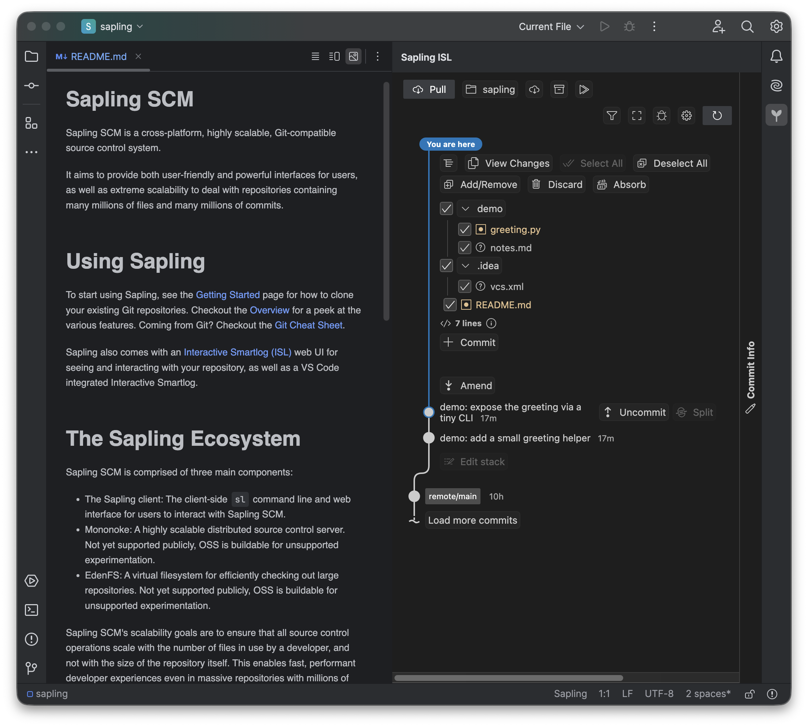
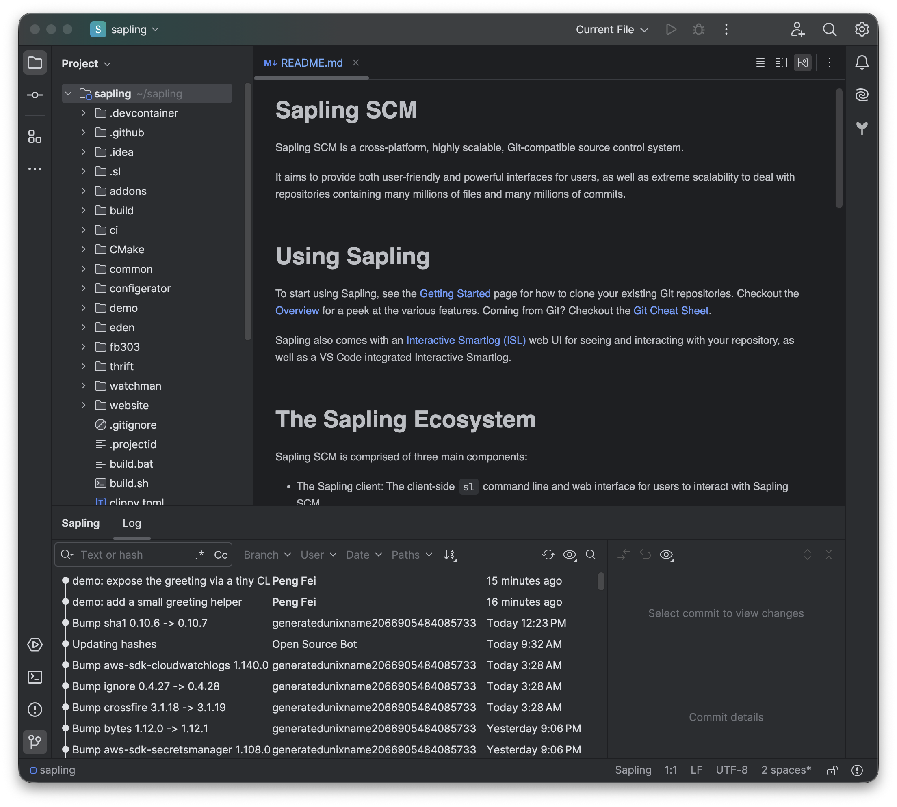

# Sapling SCM Integration for JetBrains IDEs

> Use [Sapling SCM](https://sapling-scm.com/) (`sl`) in your JetBrains IDE — full version-control support for Sapling repositories, plus Sapling's [Interactive Smartlog (ISL)](https://sapling-scm.com/docs/addons/isl) built right into a tool window.

[](LICENSE)
[](https://plugins.jetbrains.com/docs/intellij/)
[](https://kotlinlang.org/)
[](https://github.com/pfei-sa/sapling-jetbrains/actions/workflows/verify-plugin.yml)

> **Unofficial / independent project.** Not affiliated with, endorsed by, or sponsored by Meta.
> "Sapling" is a trademark of Meta Platforms, Inc.; it's used here only to describe the software this plugin works with.

Sapling repositories don't work with the built-in Git integration. This plugin fills that gap: it gives Sapling checkouts real IDE version control, and embeds Sapling's own Interactive Smartlog so you can see and manage your commits without leaving the editor.

---

## Screenshots

**Interactive Smartlog (ISL)**, docked beside the editor and theme-synced to the IDE — view changes, commit, amend, and navigate your commit stack:



**Repository log** — the commit graph with authors, dates, and bookmarks:



---

## Features

**Version control for Sapling repositories**

- **Changes** — see modified, added, removed, and untracked files at a glance.
- **Diff** — compare any file against its committed version, side by side.
- **Revert** — roll back local changes with the IDE's standard Revert action.
- **History & blame** — browse a file's past revisions, and see who last changed each line.
- **Repository log** — the full commit graph with authors, dates, and bookmarks.
- **Conflict resolution** — resolve merge conflicts in the IDE's built-in 3-way merge tool.
- **Common actions** — pull, push, goto, uncommit, shelve/unshelve, manage bookmarks, and copy a commit hash, right from the VCS menu.

> Committing and amending happen in the embedded ISL (below), not the IDE's Commit tool window — matching Sapling's no-staging-area workflow. The IDE's commit message box is hidden by default (the Local Changes view stays for reviewing and reverting); you can restore the native commit pane in **Settings → Tools → Sapling** if you prefer.

**Interactive Smartlog, built in**

- Opens Sapling's web UI in a dockable **Sapling ISL** tool window.
- Click a file in ISL to open it in the editor.
- ISL "copy" actions use the IDE clipboard, and the ISL theme follows your IDE's light/dark theme.

---

## Requirements

- A JetBrains IDE on **IntelliJ Platform 2024.2 or newer** (IntelliJ IDEA and other IntelliJ-based IDEs). The ISL tool window needs a JCEF-enabled build — most official builds qualify.
- The **Sapling CLI (`sl`)** installed and on your `PATH` — see [sapling-scm.com](https://sapling-scm.com/). You can point the plugin at a specific `sl` in *Settings → Tools → Sapling*.

---

## Installation

No Marketplace release yet — install from a built zip:

1. Build it: `./gradlew buildPlugin` → the zip lands in `build/distributions/`.
2. In your IDE: *Settings → Plugins → ⚙ → Install Plugin from Disk…*, select the zip, and restart.
3. Open a Sapling repository. `.sl` repositories are detected automatically — accept the **Sapling** VCS mapping if prompted. Open the **Sapling ISL** tool window (docked right) to use ISL.

> A Git-backed Sapling checkout (one with a `.git` directory) stays with the built-in Git integration by default; the plugin shows a one-time hint if you'd rather switch it to Sapling under *Settings → Version Control → Directory Mappings*.

---

## Configuration

*Settings → Tools → Sapling*:

- **`sl` executable path** — defaults to `sl` on your `PATH`; override if it lives elsewhere.
- **Auto-open ISL** — open the Sapling ISL tool window automatically for Sapling projects (off by default).
- **Hide IDE commit UI (commit in ISL)** — hide the IDE's inline commit box and gray the Commit action so committing happens in ISL (on by default). Applies to the commit box after reopening the project.

---

## Known limitations (v0.1)

- Ignored files aren't shown in the Changes view (untracked and missing files are).
- A commit's changed-file list in the repository log isn't populated yet (the graph, authors, and messages are).
- ISL behavior is best experienced in a running IDE and can vary with your Sapling version.

---

## Building from source

Requires **JDK 21**.

```bash
./gradlew buildPlugin   # build the installable zip
./gradlew runIde        # try it in a sandbox IDE
./gradlew test          # run the tests
```

See [`CLAUDE.md`](CLAUDE.md) for the architecture and contributor conventions.

---

## Contributing & security

Issues and pull requests are welcome — please keep the non-affiliation and trademark notices intact.

Found a security issue? Please report it privately — see [`SECURITY.md`](SECURITY.md). Note that opening a repository runs `sl` inside it, so only open repositories you trust.

---

## License

[MIT](LICENSE). Sapling itself is GPLv2, but this plugin contains none of its code — it only runs the `sl` command-line tool as a separate process — so the plugin's own code is independently licensed. Please keep the non-affiliation and trademark notices when redistributing.

---

## Acknowledgements

- [Sapling SCM](https://sapling-scm.com/) and its Interactive Smartlog, created by Meta — the tools this plugin works with.
- Built on the [IntelliJ Platform](https://plugins.jetbrains.com/docs/intellij/welcome.html).
